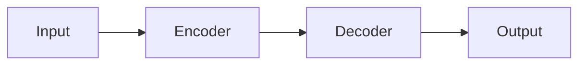

# Read Paper

Turn a research paper into a structured analysis across 4 passes to output a **PACES** analysis (Purpose / Approach / Claims / Evaluation / Synthesis). Read the user's `MEMORY.md` first to calibrate the analysis to their domain expertise: existing knowledge, active focus, and applicable methods.

> **Tool portability.** This skill names tools by capability, not by vendor. See [Tool Capability Reference](#tool-capability-reference). If your agent lacks a capability, report back before substituting.

---

## Routing — which entry point?

| Input from user | Entry point |
|---|---|
| arXiv URL (`https://arxiv.org/abs/...` or `.../pdf/...`) | Fetch via arXiv → continue |
| Local PDF path (e.g. `~/papers/transformer.pdf`) | Open PDF → continue |
| Paper title only (no file / URL) | Web-search for arXiv / open-access PDF → continue |
| Screenshot / photo of paper page | OCR + extract text → continue |
| Already-extracted paper text | Skip fetch → continue at [Pass 1](#pass-1--title--abstract--illustrations) |

If the user wants **multiple** papers in batch → do NOT use this skill; defer to `research-workflow`.

---

## Step 0 — Resolve Inputs

Before reading, establish the context that shapes the output:

### Memory source
Locate the user's memory file in this priority order:
1. `MEMORY.md` in the current working directory.
2. `AGENTS.md` / `CLAUDE.md` / `SYSTEM.md` / `docs/*` in the current workspace.
3. If none found and the workspace is non-empty, ask once: *"Where's your MEMORY.md? It holds your domain knowledge — I'll calibrate the analysis to what you already know and what you can use."*

**What `MEMORY.md` contains:** The user's domain knowledge. It defines: (a) existing understanding, (b) active focus, and (c) applicable methods. It is a domain profile, not a generic scratchpad or citation database.

If still unavailable, proceed without memory linking — note this in the final analysis (`memory_links: none — no MEMORY.md provided`).

### Output directory
- If the user gives an explicit directory → use it.
- Otherwise → use `docs/paper_summary/` (auto-create). File name: `<paper-slug>_<YYYYMMDD>.md`. Slug = lowercased, dashes for spaces, first author surname + year + 1–3 keywords (e.g. `smith-2024-attention-routing`), max ~40 chars, alphanumerics + dashes only.

### Output format
- Default: **Markdown**.
- HTML only if the user asks for HTML explicitly.

### Output language
- If the user's request is in Vietnamese → write the analysis in Vietnamese (keep technical terms, paper titles, author names, citation strings in original English).
- Otherwise → English.

---

## The 4-Pass Reading Strategy

Reading front-to-back kills retention. Each pass answers a distinct question at a progressively narrower scope.

### Pass 1 — Title, abstract, illustrations
**Goal:** Decide whether this paper is worth your time and what its single contribution is.

- Read the title and abstract cold.
- Look at *every figure* and *every table*. In ML/AI, one or two figures often carry the entire argument.
- After this pass you should be able to state the paper's one-line claim. If you cannot, the abstract obscures the contribution — keep reading.

### Pass 2 — Intro + Conclusion + figures, skim the rest
**Goal:** Get the accurate author-stated framing.

- Read the Introduction and Conclusion end-to-end. These are the two sections authors write most carefully — they contain the clearest framing.
- Re-skim the figures with the intro/conclusion framing in mind. The captions now mean something.
- Skim the remaining section headings. You're mapping the structure, not absorbing content yet.

### Pass 3 — Full paper, skip math at first read
**Goal:** Build a working mental model.

- Read the body end-to-end. Skip dense mathematical derivations on first encounter — bookmark them.
- Focus on: the architecture diagram, the algorithm pseudocode, the experimental setup, and the headline result table.
- After this pass you should be able to explain the paper to a colleague in 5 minutes.

### Pass 4 — Targeted deep dive
**Goal:** Answer your specific questions, not understand everything.

- Return to the bookmarked math, the appendix, and the experimental details *only* as needed.
- Do **not** try to understand every part of a cutting-edge paper on first reading. Authors themselves often can't predict which details matter.

> **Why this order works.** Pass 1 stops you from sinking 3 hours into a paper that's wrong for you. Pass 2 grounds your mental model in the author's own framing (not your misreading). Pass 3 builds the working model. Pass 4 is for the parts that earn their reading time. Skipping ahead to Pass 4 is the classic mistake.

Each pass declares a completion criterion. Use them as stop signals — they are agent-checkable, not time-based. Concrete checks per pass:

- **Pass 1 check:** write a single sentence naming the paper's contribution. If you can't, the contribution is hidden — keep reading.
- **Pass 2 check:** produce a 3-sentence explanation (problem / method / headline result) in your own words.
- **Pass 3 check:** produce a 5-minute explanation (one paragraph) you could deliver to a colleague.
- **Pass 4 check:** state the answer to your specific question, then stop.

---

## While reading — answer these four questions

Keep these questions active throughout all four passes. Write the answers into your draft continuously, not at the end.

1. **What did the authors try to accomplish?** *(Fills `P – Purpose`)*
2. **What are the key elements of the approach?** *(Fills `A – Approach`)*
3. **What is the user paying attention to right now? What can they apply?** → answered by `MEMORY.md` calibration signals B (active focus) and C (applicable methods) — see `references/memory-cross-reference.md`. Shapes which parts of the analysis get depth.
4. **What other references does the user want to follow?** → adds to `MEMORY.md` reading-list *(Builds the user's future reading pipeline)*

Question 3 separates a tailored analysis from a generic summary. Without `MEMORY.md`, the analysis lacks user-specific relevance.

---

## Output — the PACES Framework

Write the analysis using PACES. Each section has a specific purpose; do not blur them.

| Letter | Question it answers | Source in paper |
|---|---|---|
| **P** – Purpose | *Why* does this paper exist? | Problem statement, research gaps, motivation (Intro) |
| **A** – Approach | *How* did they solve it? | Method, architecture, algorithm, novelty |
| **C** – Claims | *What* do they assert? | Headline results, ablations, theoretical claims |
| **E** – Evaluation | *How* do they prove it? | Datasets, baselines, metrics, ablations, statistical tests |
| **S** – Synthesis | *So what?* | Intro/Discussion/Conclusion, limitations, future work |

Detailed definitions, key indicators, and worked phrasing for each letter are in `references/paces-method.md`. **Load it before drafting** — vague PACES sections are the most common failure mode.

---

## Output Template

Always use this template. Replace every `<…>` placeholder.

```markdown
---
title: <paper title>
description: <one-line description of what the paper is about, topic, domain>
published_year: <YYYY>
author: <list of authors>
domain: <list of domains, e.g. ["NLP", "Computer Vision"]>
keywords: <list of keywords>
arxiv_id: <arxiv id if applicable, e.g. "2405.07960">
memory_links:
  used: <list of MEMORY.md sections the user already knows — explains what was skipped in the analysis, or "none">
  applicable_to: <specific user projects/questions the paper maps to — the most valuable field, or "none">
  follow_up: <new entries to add to MEMORY.md reading-list, or "none">
---

# <Paper title>

## 1. P — Purpose (The "Why")
<paragraphs: problem statement, research gaps, why it matters>

## 2. A — Approach (The "How")
<paragraphs: method summary, what is novel, key workflow>


## 3. C — Claims (The "What")
<paragraphs: headline claims, e.g. "Achieved 15% efficiency gain on dataset X">

## 4. E — Evaluation (The "Proof")
<paragraphs: datasets, baselines, metrics, ablations, statistical tests>

<tables or inline metrics here>

## 5. S — Synthesis (The "Big Picture")
<paragraphs: significance, relationship to prior work, practical applications>


## References
- [1] <author>, <title>, <venue/year> — <url>
- [2] ...

---

*Generated via read-paper skill — <YYYY-MM-DD>*
```

**Image handling.** If the paper has a key architecture diagram, embed it inline. Either extract from the PDF (preferred — keeps the figure pristine) or render a Mermaid block:

````markdown

````

For full worked example, see `examples/sample-paces-analysis.md`.

---

## Cross-Referencing MEMORY.md

This step calibrates the analysis to **who the user is** in this domain. Before drafting (or while drafting), read `MEMORY.md` to answer:

1. **What does the user already know?** Skip basics the user has mastered; emphasize what is novel to them. → fills `memory_links.used` in the frontmatter.
2. **What is the user paying attention to right now?** Highlight parts of the paper that match their active interests/projects. → call these out inline in the relevant PACES letter.
3. **What can the user apply themselves?** Cross-link the paper's method to their ongoing work; add new entries to `MEMORY.md` under a `## Reading list` section for future reads.

Format the new entry:
```markdown
- [ ] **<paper title>** (<year>, <authors>) — <one-line reason it caught your attention> — <path to analysis>
```

Detailed patterns are in `references/memory-cross-reference.md`.

---

## Anti-patterns — what NOT to do

- **Reading front-to-back on first pass.** You'll spend 90 minutes to discover the paper isn't relevant to you.
- **Bulletizing the whole PACES.** Each letter is a paragraph-driven analysis, not a checklist. Use bullets only inside `E` for tables.
- **Conflating `C` and `E`.** Claims are what authors *say*; Evaluation is how they *prove it*. Mixing them hides whether the evidence supports the claim.
- **Forgetting `S`.** Synthesis is where you write the take a colleague would actually want — the "so what". Without it, the analysis is a glorified abstract.
- **Skipping memory calibration.** An uncalibrated read produces a generic summary that wastes the user's context.
- **Hallucinating figures.** If you can't extract or render a real figure, say so explicitly — don't invent a placeholder that looks real. *Example of failure: drawing a Mermaid block that resembles a Transformer encoder/decoder without naming the paper's actual modules, then claiming it represents Figure 1.*

---

## Tool Capability Reference

| Capability | Examples (Claude Code, Hermes, Pi Agent, OpenCode) |
|---|---|
| Open URL, return page content | `WebFetch`, `browser_navigate`, `url_open` |
| Download file via HTTP | `curl <url> -o <path>`, `Bash` |
| Run shell command | `Bash`, `terminal` |
| Extract PDF text | `docling` (Python API or CLI), `pdfplumber`, `pdftotext` |
| Read local file | `Read`, `read_file` |
| Write local file | `Write`, `write_file` |
| Search file contents | `Grep`, `grep -n` |
| Edit file in place | `Edit`, `patch` |
| Ask the user a multiple-choice question | `AskUserQuestion`, `clarify` |

**Universal nouns (no mapping needed):** `terminal`, `python3`, `curl`, `bash`, `git`, `uv`, `pip`, `node`, `mermaid`, `arxiv.org`, `https://`.

**When a tool is missing:** Report back to the user before substituting.

---

## Support Files

### `references/` — load on demand

- **`references/paces-method.md`** — **Load before drafting the output.** Definitions, key indicators, pitfalls, and worked phrasing for each PACES letter.
- **`references/memory-cross-reference.md`** — **Load before reading the paper** (Step 0). Calibration signals, PACES letter adjustments, and reading list update format.
- **`references/paper-sources.md`** — **Load in Step 0** when fetching paper text (arXiv curl recipes, local PDF extraction, OCR fallback).

### `examples/` — output reference

- **`examples/sample-paces-analysis.md`** — Worked PACES analysis of *"Attention Is All You Need"* (Vaswani et al., 2017). Load during drafting as a format reference, not content to copy.

---

## Quick-start recipe

```text
1. Resolve inputs (memory file, output dir, language).
2. Fetch paper text (arXiv curl → docling extract, or local PDF via docling).
3. Pass 1: title + abstract + figures → one-line claim.
4. Pass 2: intro + conclusion + re-skim figures → accurate framing.
5. Pass 3: full paper body, skip math → 5-minute explanation.
6. Pass 4: targeted deep dive → answer your specific questions.
7. Draft PACES using references/paces-method.md.
8. Embed key figures (extract or Mermaid).
9. Cross-reference MEMORY.md and add follow-up entries.
10. Save to <output_dir>/<slug>_<YYYYMMDD>.md.
```
