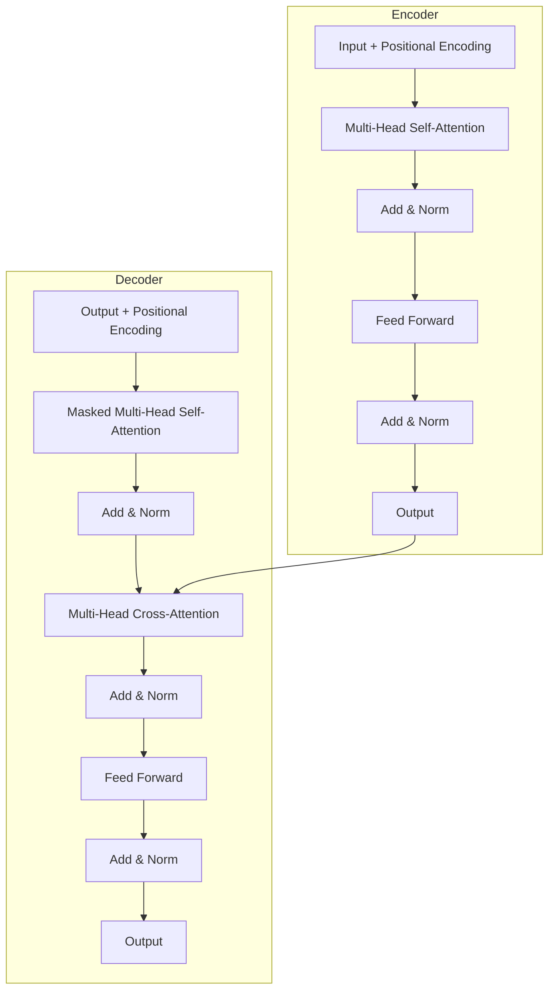

# Attention Is All You Need

## 1. P — Purpose (The "Why")

Recurrent neural networks — specifically LSTMs and GRUs — were the dominant architecture for sequence modeling and machine translation in 2017. They had two structural problems: (1) sequential computation that prevents parallelization across sequence positions during training, and (2) a hidden-state bottleneck that degrades performance on long sequences despite attention-augmented variants. Convolutional seq2seq models (e.g. ByteNet, ConvS2S) addressed the parallelization issue but still required O(n) or O(log n) operations to relate distant positions.

This paper's purpose is to show that recurrence and convolution are unnecessary. A pure attention-based architecture — the Transformer — can match or exceed the quality of the strongest recurrent baselines on translation while being substantially faster to train. The motivation is partly scientific (what's the minimum inductive bias we actually need?) and partly practical (training a state-of-the-art translation model in days, not weeks).

## 2. A — Approach (The "How")

The Transformer is an encoder-decoder architecture where every sublayer — both within the encoder stack and within the decoder stack — uses **multi-head scaled dot-product self-attention** instead of recurrence. There is no sequential dependency along the sequence dimension; positions are processed in parallel.

The core mechanism is **scaled dot-product attention**:

```
Attention(Q, K, V) = softmax(Q K^T / sqrt(d_k)) V
```

Here, `Q`, `K`, and `V` are learned linear projections of the input, and `1/sqrt(d_k)` scaling prevents softmax saturation in high dimensions. **Multi-head attention** runs `h` attention operations in parallel with different learned projections, then concatenates and projects the result — this allows the model to attend to information across representation subspaces simultaneously.

Because attention is permutation-equivariant, the authors add **positional encodings** — fixed sinusoidal functions of position, or learned position embeddings — to the input embeddings. The encoder consists of 6 identical layers, each with multi-head self-attention followed by a position-wise feed-forward network, with residual connections and layer normalization around each sublayer. The decoder is similar but adds a second attention sublayer that attends over the encoder output, and masks the self-attention to prevent attending to future positions during training.




The novelty is not any single component (scaled dot-product attention, residual connections, layer norm, feed-forward sublayers all existed before) but their *combination* into a model with **no recurrence and no convolution** that nonetheless matches the strongest recurrent baselines. The paper explicitly ablates each design choice.

## 3. C — Claims (The "What")

The authors claim four primary results:

- **BLEU on WMT 2014 En→De: 28.4**, exceeding the prior best (ensemble of ByteNet + ConvS2S, ~26) by more than 2 BLEU, including ensembles.
- **BLEU on WMT 2014 En→Fr: 41.8**, exceeding prior single-model state-of-the-art (~40.4) and matching or exceeding published ensembles.
- **Training cost:** the big Transformer model trains in ~3.5 days on 8 P100 GPUs — an order of magnitude less training compute than comparable RNN/CNN baselines at matched quality.
- **Generalization:** the architecture transfers well to other tasks (English constituency parsing) with minimal task-specific tuning.

The authors also make several structural claims backed by ablation: (a) multi-head attention is strictly better than single-head, (b) the key-dimension scaling matters (without `1/sqrt(d_k)`, training collapses), (c) residual dropout and label smoothing are important for generalization on small datasets.

## 4. E — Evaluation (The "Proof")

**Datasets:** WMT 2014 English-German (~4.5M sentence pairs) and WMT 2014 English-French (~36M sentence pairs). Both standard machine-translation benchmarks. Shared byte-pair encodings (BPE) for En-De, word-piece for En-Fr.

**Baselines:** ByteNet, ConvS2S, GNMT + RL, and various published ensembles. Strong, recent, and representative of the 2017 state of the art.

**Metrics:** BLEU on the test sets (newstest2013 for validation, newstest2014 for test). Human evaluation on a subset of En-Fr translations to check BLEU correlates with perceived quality.

**Hardware:** 8 NVIDIA P100 GPUs; base model trained ~12 hours, big model ~3.5 days.

**Ablations:** the paper systematically varies (1) number of attention heads (best at 8), (2) attention key dimension, (3) model size, (4) dropout, (5) positional encoding type (sinusoidal vs. learned — comparable). The ablation table is in section 6.4 and is unusually thorough for the era.

**Statistical rigor:** training is run with multiple seeds but the paper does not report seed-to-seed variance for headline BLEU — a known gap.

| Model | En-De BLEU | En-Fr BLEU | Training cost |
|---|---|---|---|
| ByteNet (Kalchbrenner et al., 2017) | 23.75 | — | — |
| ConvS2S (Gehring et al., 2017) | 25.16 | 40.46 | — |
| GNMT + RL (Wu et al., 2016) | 24.6 | 39.2 | 6 days, 96 GPUs |
| Transformer (base) | 27.3 | 38.1 | 12 hours, 8 GPUs |
| **Transformer (big)** | **28.4** | **41.8** | 3.5 days, 8 GPUs |

## 5. S — Synthesis (The "Big Picture")

This is one of the rare papers that genuinely resets a field. Before this, attention was understood as an *auxiliary* mechanism bolted onto recurrent encoders-decoders; after this, recurrence is the auxiliary mechanism and attention is the foundation. Every modern large language model — GPT, BERT, T5, LLaMA, Claude — descends from this architecture.

**Relationship to prior work:** The paper sits in a longer line of attention research (Bahdanau et al., 2014; Luong et al., 2015) but inverts the framing: where Bahdanau used attention to *help* a recurrent decoder, Vaswani et al. ask whether attention alone is enough. The result — yes — is the surprise.

**Practical applications:** Machine translation was the immediate target; BERT (encoder-only, 2018) and GPT (decoder-only, 2018) followed within a year. Vision Transformers (Dosovitskiy et al., 2020) and audio transformers extended the same architecture to other modalities. By 2026, the Transformer is the de facto default for sequence modeling across modalities.

**Limitations acknowledged by the authors:**
- Quadratic cost in sequence length (`O(n^2)`) — they note this but offer no solution.
- The paper focuses on translation; transfer to other tasks is shown only for one (parsing).
- No theoretical analysis of *why* self-attention works as well as it does.

**Future work that followed:** The quadratic-cost limitation motivated FlashAttention, sparse attention, linear attention, and state-space models. Positional encoding remains an active research area (relative, RoPE, ALiBi). The decoder-only branch became dominant for generative models.

**Take for the practitioner:** Read this paper for the architecture diagram, the ablation table, and the "no recurrence, no convolution" framing. Then read BERT or GPT-2 to see how the same backbone specialized. The math is not the point — the architectural commitment is.


## References

- [1] Vaswani et al., "Attention Is All You Need", NeurIPS 2017 — https://arxiv.org/abs/1706.03762
- [2] Bahdanau, Cho, Bengio, "Neural Machine Translation by Jointly Learning to Align and Translate", ICLR 2015 — https://arxiv.org/abs/1409.0473
- [3] Gehring et al., "Convolutional Sequence to Sequence Learning", ICML 2017 — https://arxiv.org/abs/1705.03122
- [4] Devlin et al., "BERT: Pre-training of Deep Bidirectional Transformers for Language Understanding", NAACL 2019 — https://arxiv.org/abs/1810.04805
- [5] Dao et al., "FlashAttention: Fast and Memory-Efficient Exact Attention with IO-Awareness", NeurIPS 2022 — https://arxiv.org/abs/2205.14135

---

*Generated via read-paper skill — 2026-09-14*
