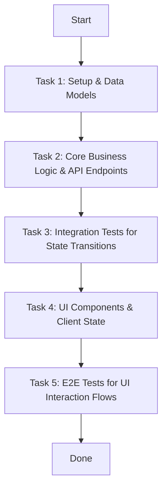

# User Designer Skill

The **User Designer** skill transforms approved requirement documents into detailed technical designs (`design.md`), E2E/integration test cases, UI/UX mockups (`mockup/*.md`), and actionable implementation plans (`plan.md`).

This skill operates via two sequential sub-commands:
1. **`DESIGN`**: Focuses on technical architecture, API/data contracts, E2E & integration test cases (UI flows & data/state transitions), and UI mockups. Halts for user review and approval.
2. **`PLAN`**: Transforms the approved design (including designed test cases) into a structured task breakdown (`plan.md`) ready for implementation.

## SDLC Workflow Position

```
[0. wiki-manager] (Init & Central Knowledge Hub)
       │
       ▼
[1. requirement-analyzer]
       │
       ▼
[2a. user-designer DESIGN] ──► Produces design.md & mockup/*.md ──► User Reviews/Approves
       │
       ▼
[2b. user-designer PLAN]   ──► Produces plan.md (from approved design.md)
       │
       ▼
[3. constructor]
       │
       ├──► [4a. quality-reviewer]  ──(loop)──┐
       │                                      ▼
       └──► [4b. security-reviewer] ──(loop)──┴─► [User Confirmation]
```

> **Current Position**: `user-designer` (Step 2 — Technical Design & Mockups via `DESIGN`, Implementation Planning via `PLAN`)

---

## Command 1: `DESIGN` (`/user-designer DESIGN`)

Use this command to create the Technical Design (`design.md`) with E2E/Integration test cases, and UI Mockups (`mockup/*.md`).

### Prerequisite Check
- Ensure `wiki/<NNN>-<feature>/requirement.md` exists and is approved.
- If missing, stop and instruct the user: *"Requirement specification not found. Please run `/requirement-analyzer` first to gather and persist requirements."*

### Execution Workflow

```
[requirement.md & wiki/SYSTEM.md]
              ↓
1. Read Requirement & Scope Assessment
              ↓
2. Create Technical Design (design.md: Architecture, API, Data Models, E2E & Integration Test Cases)
              ↓
3. Evaluate UI Need ──→ [UI Involved?] ──Yes──> Create Mockup (DESIGN.md → mockup/*.md)
              │                                    │
              └───No (Backend/API/CLI) ────────────┤
                                                   ↓
4. Persist to LLM Wiki & Sync (wiki_tool.py sync)
                                                   ↓
5. User Design Review Loop (Present design.md with Test Cases & Mockups)
```

#### Step 1: Read Requirement & Architectural Context
1. Read `wiki/<NNN>-<feature>/requirement.md` using the `wiki-manager` skill.
2. Read `wiki/SYSTEM.md` for architectural context: verify tech stack, component topology, directory structure, and application boundaries.
3. Extract Requirement ID (`req-xxx`), User Stories (`US-xxx`), Functional Requirements (`FR-xxx`), and Success Criteria.

#### Step 2: Create Technical Design (`design.md`)
1. Write `wiki/<NNN>-<feature>/design.md` using the template in `wiki-manager/references/templates.md#design-template`.
2. Key sections:
   - **Architecture**: Service boundaries, component breakdown, module interactions, and rationale.
   - **API Contracts**: Endpoints, HTTP methods, request/response schemas, error codes.
   - **Data Models**: Database schemas, entities, relations, field constraints.
   - **E2E & Integration Test Cases (Design)**:
     - **UI Interaction & E2E Flows**: Explicit test flows capturing step-by-step user interaction with the UI (e.g., input steps, button clicks, validation triggers, loading spinners, toast/feedback messages, dialog transitions).
     - **State Transitions & Data Flow**: Integration test scenarios tracing data propagation across components/services and state transitions (e.g., state lifecycle changes like `pending` -> `in_progress` -> `completed`, event broadcasting, database persistence, and side effects).
   - **UI Summary**: List of screens/components linking to `mockup/` (or `N/A (Backend/CLI)`).
   - **Acceptance Criteria**: Verifiable functional criteria mapped from requirement's Success Criteria.
3. Link frontmatter: `derived_from: [req-xxx]`, `status: approved` (or `draft`).

#### Step 3: Evaluate UI Need & Create Mockup (Optional)
- **If UI/UX is involved**:
  1. Read `wiki/DESIGN.md` for project-wide UI tokens, components, and styling conventions.
  2. Create `wiki/<NNN>-<feature>/mockup/<screen-slug>.md` using ASCII wireframes per [references/ascii_wireframe_guide.md](references/ascii_wireframe_guide.md).
  3. Include: `## Screen Name`, wireframe block, `## Components`, `## Interactions`, and `## Related Requirements`.
- **If Backend / API / CLI only**:
  1. Omit the `mockup/` directory.
  2. Mark `UI Summary: N/A (Backend / Non-UI feature)` in `design.md`.

#### Step 4: Persist, Validate & Sync
1. Validate the technical design document:
```bash
python <SKILLS_DIR>/user-designer/scripts/validate_design.py wiki/<NNN>-<feature>/design.md
```
2. Sync the wiki registry:
```bash
python <SKILLS_DIR>/wiki-manager/scripts/wiki_tool.py sync
```

#### Step 5: User Design Review & Handoff Hint
1. Present `design.md` (including architecture, API contracts, data models, and E2E/integration test cases) and `mockup/*.md` (if any) to the user for review.
2. Iterate on changes if the user requests modifications.
3. **Explicit Handoff Hint**: Once the user approves the technical design and mockups:
   - *"The technical design, test cases, and UI mockups are ready and synced in `wiki/<NNN>-<feature>/`. If you approve this design, run `/user-designer PLAN` (or type `user-designer PLAN`) to generate the Implementation Plan (`plan.md`)."*

---

## Command 2: `PLAN` (`/user-designer PLAN`)

Use this command to transform approved design specifications, test cases, and UI mockups into an actionable implementation plan (`plan.md`).

### Prerequisite Check (Mandatory)
- Check for the existence of `wiki/<NNN>-<feature>/design.md` (and `mockup/` if UI is required).
- **If `design.md` does NOT exist**:
  - **Halt execution immediately.**
  - Guide the user: *"Technical design file `wiki/<NNN>-<feature>/design.md` not found. Please run `/user-designer DESIGN` first to produce the technical specifications and mockups before creating the implementation plan."*

### Execution Workflow

```
[Approved design.md & mockup/*.md]
              ↓
1. Read Approved Design & Mockups
              ↓
2. Draft Implementation Plan (plan.md with Tasks & Mermaid diagram)
              ↓
3. Persist to LLM Wiki & Sync (wiki_tool.py sync)
              ↓
4. Validate (validate_plan_mockup.py)
              ↓
5. Next Skill Guidance (Handoff to constructor)
```

#### Step 1: Read Approved Design & Context
1. Read `wiki/<NNN>-<feature>/design.md` and any mockups in `wiki/<NNN>-<feature>/mockup/`.
2. Extract API contracts, schema models, component interactions, E2E & integration test cases, and acceptance criteria.

#### Step 2: Draft Implementation Plan (`plan.md`)

1. **Task Breakdown Guidelines**:
   - **Implementation Tasks (`id: I-xxx`, `type: implementation`)**:
     - Deconstruct the feature into modular architectural layers: Database & Models -> Core Business Logic/Services -> API Controllers/Routes -> UI Components & Pages.
     - Provide actionable, sequential steps with concrete target files and functions for each task.
   - **Testing Tasks (`id: T-xxx`, `type: testing`)**:
     - **Direct Mapping from `design.md`**: Every test scenario designed in `## E2E & Integration Test Cases` of `design.md` must have at least one dedicated testing task in `plan.md`.
     - **Test Level Classification**:
       - *Unit Tests*: Test isolated business logic, helper utilities, data validation schemas, and individual UI component render/interaction states.
       - *Integration Tests*: Test API endpoint contracts, request/response validation, database transactions, and data/state transition flows (`TC-INT-xxx`).
       - *E2E Tests*: Test complete user interaction journeys on UI (`TC-E2E-xxx`), form submissions, loader indicators, toast/feedback messages, and screen navigation flows.
     - **Testing Task Details**: Explicitly specify target test runner/framework (e.g. `pytest`, `vitest`, `playwright`), target test file path (e.g. `tests/e2e/test_task_flow.spec.ts`), and expected assertions.
   - **Implementation Process Flow (`mermaid`)**:
     - Construct a clear Mermaid flowchart (`graph TD`) illustrating execution dependencies.
     - Sequence testing tasks logically alongside or following corresponding implementation tasks to ensure continuous verification before completion.

2. Write `wiki/<NNN>-<feature>/plan.md` using the standard template:

```markdown
---
id: plan-001
title: Implementation Plan for Requirement 001
status: in_progress
derived_from:
  - req-001
---

# Plan: <Title>

## Implementation Plan
<detailed implementation breakdown, architecture approach, and technology choices>

## Implementation Process



## Tasks

### Task 1: <Setup & Models>

- **id**: I-001
- **type**: implementation
- **description**: <description of task 1>
- **status**: pending
- **steps**:
  1. <Step 1>
  2. <Step 2>

### Task 2: <Business Logic & API Endpoints>

- **id**: I-002
- **type**: implementation
- **description**: <description of task 2>
- **status**: pending
- **steps**:
  1. <Step 1>
  2. <Step 2>

### Task 3: <Integration Tests for State Flow (TC-INT-001)>

- **id**: T-003
- **type**: testing
- **description**: Implement integration tests for task lifecycle state transitions mapped from TC-INT-001
- **status**: pending
- **steps**:
  1. Write integration tests in `tests/integration/test_task_state.py` verifying status transitions (`pending` -> `in_progress` -> `completed`)
  2. Assert database state updates and event notification dispatching

### Task 4: <UI Components & Interaction>

- **id**: I-004
- **type**: implementation
- **description**: <description of UI task>
- **status**: pending
- **steps**:
  1. <Step 1>
  2. <Step 2>

### Task 5: <E2E Tests for UI Interaction Flow (TC-E2E-001)>

- **id**: T-005
- **type**: testing
- **description**: Implement E2E tests validating the full task creation and listing interaction flow mapped from TC-E2E-001
- **status**: pending
- **steps**:
  1. Write E2E test in `tests/e2e/test_task_flow.spec.ts` testing form submission, loading spinner, toast display, and table update
  2. Run test runner and verify clean assertions

## UI Mockup (if applicable)
- Relative link: `mockup/screen-name.md` OR `N/A (Backend/CLI requirement)`
```

#### Step 3: Persist & Sync
Sync `wiki/registry.yaml`:
```bash
python <SKILLS_DIR>/wiki-manager/scripts/wiki_tool.py sync
```

#### Step 4: Validate Plan & Mockup
Run the validator script:
```bash
python <SKILLS_DIR>/user-designer/scripts/validate_plan_mockup.py wiki/<NNN>-<feature>/plan.md
```

#### Step 5: Next Skill Guidance (Handoff to Constructor)
Present the finalized `plan.md` to the user and **explicitly guide them to the next step in the New SDLC workflow**:
- *"The implementation plan has been established and validated in `wiki/<NNN>-<feature>/plan.md`. Next in the New SDLC workflow, run the `/constructor` skill (or type `constructor`) to begin executing implementation tasks, running tests, and generating verification evidence (`evidence.md`)."*
