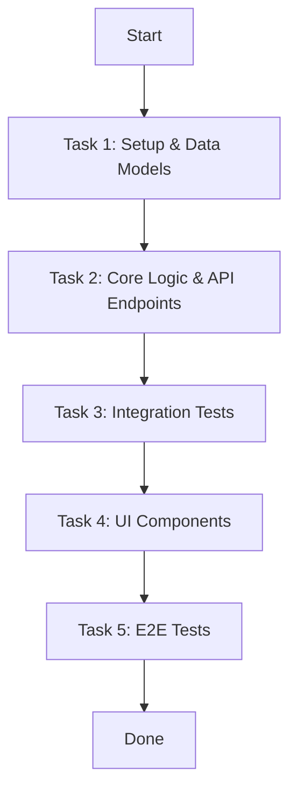

# User Designer Skill

Convert approved requirements into technical designs (`design.md`), UI wireframes (`mockup/*.md` or `mockup/*.html`), and implementation plans (`plan.md`).

This skill runs three sub-commands:
1. **`DESIGN`** (default): Produces `design.md` (architecture, API/data contracts, test cases) and `mockup/*.md` (ASCII wireframes). Halts for user review.
2. **`DESIGN html`**: Produces `design.md` and `mockup/*.html` (interactive single-file HTML prototypes that follow `wiki/DESIGN.md` tokens). Use when the user requests an HTML prototype, click-through, or visual demo. Halts for user review.
3. **`PLAN`**: Breaks approved designs into tasks in `plan.md` for Constructor.

## SDLC Workflow Position

```
[0. wiki-manager] (Init & Central Knowledge Hub)
       │
       ▼
[1. requirement-analyzer]
       │
       ▼
[2a. user-designer DESIGN] ──► Produces design.md & mockup/*.md ──► User Approval
       │
       ▼
[2b. user-designer PLAN]   ──► Produces plan.md (from approved design.md)
       │
       ▼
[3. constructor]
       │
       ├──► [4a. quality-reviewer]  ──(loop)──┐
       │                                      ▼
       └──► [4b. security-reviewer] ──(loop)──┴─► [User Confirmation]
```

---

## Command 1a: `DESIGN` (`/user-designer DESIGN`) — ASCII wireframe mode

Create the technical design (`design.md`) and ASCII UI mockups (`mockup/*.md`).

### Prerequisite Check
Ensure `wiki/<NNN>-<feature>/requirement.md` exists and is approved. If missing, tell the user to run `/requirement-analyzer` first.

### Workflow

```
[requirement.md & wiki/SYSTEM.md]
              ↓
1. Read Requirements & Scope Assessment
              ↓
2. Create Technical Design (design.md: Architecture, API, Data Models, Test Cases)
              ↓
3. Evaluate UI Need ──→ [UI Involved?] ──Yes──> Create Mockup (DESIGN.md + SYSTEM.md + semantic search → mockup/*.md)
              │                                    │
              └───No (Backend/API/CLI) ────────────┤
                                                   ↓
4. Persist, Validate & Sync (validate_design.py & wiki_tool.py)
                                                   ↓
5. User Review Loop (Present design.md and Mockups)
```

#### Step 1: Read Requirements and Architecture Context
1. Read `wiki/<NNN>-<feature>/requirement.md`.
2. Read `wiki/SYSTEM.md` to verify tech stack, directory structure, and module boundaries.
3. Note Requirement IDs (`req-xxx`), User Stories (`US-xxx`), Functional Requirements (`FR-xxx`), and Success Criteria.

#### Step 2: Create Technical Design (`design.md`)
1. Write `wiki/<NNN>-<feature>/design.md` using the template in `wiki-manager/references/templates.md#2-design-template`.
2. Include these sections:
   - **Architecture**: Service boundaries, components, and module interactions.
   - **API Contracts**: Endpoints, HTTP methods, request/response schemas, error codes.
   - **Data Models**: Schemas, entities, relations, field types, and constraints.
   - **E2E & Integration Test Cases**:
     - *UI Flows*: User actions, form inputs, loaders, toasts, and screen transitions.
     - *State Transitions & Data Flow*: Lifecycle state changes, event emission, DB updates, and side effects.
   - **UI Summary**: List of screens linking to `mockup/` (or `N/A (Backend / Non-UI feature)`).
   - **Acceptance Criteria**: Verifiable criteria mapped from requirement Success Criteria.
3. Frontmatter: set `derived_from: [req-xxx]`, `status: approved` (or `draft`).

#### Step 3: Create UI Mockups (Optional)

- **If UI is involved:**
  1. **Read context (mandatory before drawing)**:
     - `wiki/DESIGN.md` — design tokens, components, styling rules.
     - `wiki/SYSTEM.md` — tech stack, app boundaries, navigation patterns (e.g., shared layout, auth guards, role-based nav).
  2. **Find related prior work via semantic search on `registry.yaml`**:
     - Read `wiki/registry.yaml#modules[].description` for every module.
     - Identify modules whose descriptions overlap with the current feature (similar entity names, overlapping user flows, shared screens).
     - Open those modules' `mockup/*.md` (or `mockup/*.html`) files and reuse patterns: consistent header layout, button placement, table column order, empty-state copy, error toasts.
     - If no related modules exist, proceed standalone and document this in the mockup.
  3. **Render the wireframe**:
     - ASCII mode (this command): write `wiki/<NNN>-<feature>/mockup/<screen-slug>.md` per `references/ascii_wireframe_guide.md`.
     - HTML mode (`DESIGN html` command): write `mockup/<screen-slug>.html` per `references/html_prototype_guide.md`.
  4. **Include in each mockup**: screen name, wireframe block, components, interactions, related requirements, and any prior module whose pattern was reused (cite module id).

- **If Backend / API / CLI only:**
  1. Omit the `mockup/` folder.
  2. Mark `UI Summary: N/A (Backend / Non-UI feature)` in `design.md`.

#### Step 4: Persist, Validate & Sync
1. Validate the technical design:
   ```bash
   python <SKILLS_DIR>/user-designer/scripts/validate_design.py wiki/<NNN>-<feature>/design.md
   ```
2. Sync the wiki registry:
   ```bash
   python <SKILLS_DIR>/wiki-manager/scripts/wiki_tool.py sync
   ```

#### Step 5: User Review
Present `design.md` and mockups to the user. Apply requested changes. Once approved, tell the user to run `/user-designer PLAN`.

---

## Command 1b: `DESIGN html` (`/user-designer DESIGN html`) — Interactive HTML prototype mode

Use this variant when the user explicitly requests an interactive HTML
prototype, click-through demo, or visual mockup. Triggers include:
"tạo prototype bằng HTML", "làm bản HTML click-through", "DESIGN html",
"interactive mockup".

### Outputs
- `wiki/<NNN>-<feature>/design.md` — same as Command 1a.
- `wiki/<NNN>-<feature>/mockup/<screen-slug>.html` — one self-contained
  HTML file per screen.
- Optional companion `wiki/<NNN>-<feature>/mockup/<screen-slug>.md`
  summarizing the component inventory for non-rendered review.

### HTML Prototype Rules
- **Self-contained**: single HTML file, embed CSS + minimal JS inline.
  No external CDN, no remote fonts, no remote images (data: URIs allowed).
- **Token-driven**: every color, font size, spacing value, radius, and
  shadow comes from `wiki/DESIGN.md` design tokens. No arbitrary hex.
- **State-aware**: at minimum, render default state, hover state, focus
  state, disabled state, loading state, and empty state for key
  components.
- **Accessible**: semantic HTML, ARIA labels for icon buttons, keyboard
  navigable, color contrast WCAG 2.1 AA.
- **Cross-references**: header/footer/nav must match the patterns reused
  from related modules (per Step 3 semantic search above).
- **Navigation**: include `<a>` links between screens of the same feature
  so the user can click through the flow.

### Workflow
Same as Command 1a, except Step 3 renders HTML per
`references/html_prototype_guide.md`. Validation step additionally runs:
```bash
python <SKILLS_DIR>/user-designer/scripts/validate_html_mockup.py \
  wiki/<NNN>-<feature>/mockup/
```

### Reference
- `references/html_prototype_guide.md` — full rendering rules, component
  library mappings, accessibility checklist, multi-screen linking.

---

## Command 2: `PLAN` (`/user-designer PLAN`)

Convert approved design specifications, test cases, and mockups into an implementation plan (`plan.md`).

### Prerequisite Check
Verify `wiki/<NNN>-<feature>/design.md` exists. If missing, halt and tell the user to run `/user-designer DESIGN` first.

### Workflow

```
[Approved design.md & mockup/*.md]
              ↓
1. Read Approved Design & Mockups
              ↓
2. Draft Implementation Plan (plan.md with Tasks & Mermaid diagram)
              ↓
3. Persist & Sync (wiki_tool.py sync)
              ↓
4. Validate (validate_plan_mockup.py)
              ↓
5. Next Step (Handoff to constructor)
```

#### Step 1: Read Approved Design and Context
1. Read `wiki/<NNN>-<feature>/design.md` and mockups in `wiki/<NNN>-<feature>/mockup/`.
2. Extract contracts, models, test cases, and acceptance criteria.

#### Step 2: Draft Implementation Plan (`plan.md`)

1. **Task Breakdown Rules**:
   - **Implementation Tasks (`id: I-xxx`, `type: implementation`)**:
     - Order tasks by layer: Data Models -> Business Services -> API Routes -> UI Components.
     - Specify target files, functions, and concrete steps for each task.
   - **Testing Tasks (`id: T-xxx`, `type: testing`)**:
     - Map every scenario in `design.md` to at least one testing task.
     - Classify test levels: Unit (isolated logic/components), Integration (`TC-INT-xxx`), E2E (`TC-E2E-xxx`).
     - Specify the runner (`pytest`, `vitest`, `playwright`), target test file, and expected assertions.
   - **Process Flow (`mermaid`)**:
     - Draw a flowchart (`graph TD`) mapping execution dependencies.

2. Write `wiki/<NNN>-<feature>/plan.md` using the template:

```markdown
---
id: plan-001
title: Implementation Plan for Requirement 001
status: in_progress
derived_from:
  - req-001
---

# Plan: <Title>

## Implementation Plan
<Architecture approach and technology choices>

## Implementation Process



## Tasks

### Task 1: <Setup & Models>
- **id**: I-001
- **type**: implementation
- **description**: <Task description>
- **status**: pending
- **steps**:
  1. <Step 1>
  2. <Step 2>

### Task 2: <Business Logic & API Endpoints>
- **id**: I-002
- **type**: implementation
- **description**: <Task description>
- **status**: pending
- **steps**:
  1. <Step 1>
  2. <Step 2>

### Task 3: <Integration Tests (TC-INT-001)>
- **id**: T-003
- **type**: testing
- **description**: Integration tests for state transitions from TC-INT-001
- **status**: pending
- **steps**:
  1. Write tests in `tests/integration/test_state.py`
  2. Assert status transitions and database updates

### Task 4: <UI Components>
- **id**: I-004
- **type**: implementation
- **description**: <UI task description>
- **status**: pending
- **steps**:
  1. <Step 1>
  2. <Step 2>

### Task 5: <E2E Tests (TC-E2E-001)>
- **id**: T-005
- **type**: testing
- **description**: E2E test for task flow from TC-E2E-001
- **status**: pending
- **steps**:
  1. Write test in `tests/e2e/test_flow.spec.ts`
  2. Run test runner and verify pass

## UI Mockup (if applicable)
- Relative link: `mockup/screen-name.md` OR `N/A (Backend/CLI requirement)`
```

#### Step 3: Persist and Sync
Sync `wiki/registry.yaml`:
```bash
python <SKILLS_DIR>/wiki-manager/scripts/wiki_tool.py sync
```

#### Step 4: Validate Plan and Mockup
Run the validator:
```bash
python <SKILLS_DIR>/user-designer/scripts/validate_plan_mockup.py wiki/<NNN>-<feature>/plan.md
```

#### Step 5: Next Step
Present `plan.md` to the user. Tell them to run `/constructor` to begin implementation.
