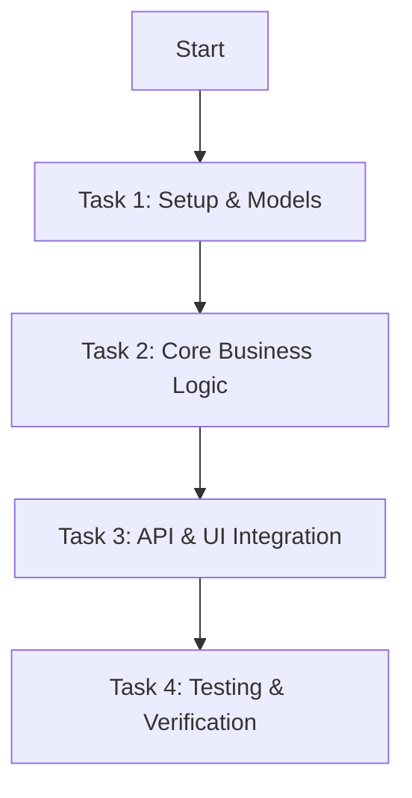

# User Designer Skill

The **User Designer** skill guides AI agents in transforming approved requirement documents into detailed technical implementation plans (`plan.md`) and UI/UX mockups (`mockup/*.md`), managing an interactive review loop with the user.

## Operational Workflow

```
[Requirement Document (requirement.md)]
                ↓
1. Read Requirement & Scope Assessment
                ↓
2. Create Technical Design (design.md) — Final approved technical spec
                ↓
3. Evaluate UI Need ──→ [UI Involved?] ──Yes──> Create Mockup (mockup/*.md)
                │                                    │
                └───No (Backend/API/CLI) ────────────┤
                                                     ↓
4. User Design Review Loop (mockup changes ↔ review)  ← User participates here
                                                     ↓
5. Draft Implementation Plan & Tasks (plan.md)
                                                     ↓
6. User Review & Revision Loop (Request Changes ↔ Update Plan)
                                                     ↓
7. Persist to LLM Wiki & Sync (wiki_tool.py sync)
                                                     ↓
8. Validation (validate_plan_mockup.py)
```

---

### Step 1: Read Requirement & Architectural Context
1. **Read `wiki/<NNN>-<feature>/requirement.md`** using the `wiki-manager` skill.
2. **Read `wiki/SYSTEM.md`** for architectural context: verify tech stack, component topology, directory structure, and application boundaries to ensure the design fits the system architecture.
3. Extract Requirement ID (`req-xxx`), User Stories (`US-xxx`), Functional Requirements (`FR-xxx`), and Success Criteria.

---

### Step 2: Create Technical Design (design.md)
Before drafting mockups or plans, create the technical design document that serves as the single source of truth for all implementation decisions:

1. **Write `wiki/<NNN>-<feature>/design.md`** using the template in `wiki-manager/references/templates.md#design-template`.
2. **Key sections to fill**:
   - **API Contracts**: Define exact endpoints, request/response schemas, HTTP methods, status codes, error formats.
   - **Data Models**: Define database schema, field types, constraints, relationships.
   - **Architecture**: High-level component breakdown, service boundaries, internal module dependencies (consistent with `wiki/SYSTEM.md`).
   - **UI Summary**: Approved screen list linking to mockups (to be created next).
   - **Acceptance Criteria**: Directly map from requirement's Success Criteria section — these are verifiable conditions Constructor will use to validate implementation.
3. **Link to parent requirement**: `derived_from: [req-xxx]` in frontmatter.
4. **Mark status**: `status: approved` (or `draft` if still pending technical decisions).
5. Persist and sync using `wiki-manager` skill:
   ```bash
   python <SKILLS_DIR>/wiki-manager/scripts/wiki_tool.py sync
   ```

---

### Step 3: Evaluate UI Need & Create Mockup (Optional)
Determine whether the feature introduces or modifies UI screens:

- **If UI/UX is involved**:
  1. **Read `wiki/DESIGN.md`**: Inspect project-wide UI/UX standards, design tokens (colors, typography, spacing, elevation), component conventions, and responsive rules. All wireframes and component specifications must adhere to `wiki/DESIGN.md`.
  2. Create `wiki/<NNN>-<feature>/mockup/<screen-slug>.md`.
  3. Use ASCII wireframe conventions from [references/ascii_wireframe_guide.md](references/ascii_wireframe_guide.md).
  4. Include sections: `## Screen Name`, ASCII wireframe block, `## Components`, `## Interactions`, and `## Related Requirements`.

- **If Backend / API / CLI only**:
  1. Skip creating the `mockup/` folder.
  2. Document `UI Mockup: N/A (Backend / Non-UI feature)` inside `plan.md`.

---

### Step 4: User Design Review Loop
Present mockups to the user for review. This is the interactive loop where the user validates UI/layout/interactions:

1. Show the mockup(s) to the user.
2. Incorporate feedback and update mockup(s) until user explicitly approves.
3. Once approved, update `design.md` UI Summary section to reflect approved mockups.
4. Mark `design.md` status as `approved` if not already set.

---

### Step 5: Draft Implementation Plan & Tasks
Write `wiki/<NNN>-<feature>/plan.md` using the standard template:

```markdown
---
id: plan-001
title: Implementation Plan for Requirement 001
status: in_progress
derived_from:
  - req-001
---

# Plan: <Title>

## Implementation Plan
<detailed implementation breakdown, architecture approach, and technology choices>

## Implementation Process



## Tasks

### Task 1: <Task Name>

- **id**: I-001
- **type**: implementation
- **description**: <description of task 1>
- **status**: pending
- **steps**:
  1. <Step 1>
  2. <Step 2>

### Task 2: <Task Name>

- **id**: T-002
- **type**: testing
- **description**: <description of task 2>
- **status**: pending
- **steps**:
  1. <Step 1>
  2. <Step 2>

## UI Mockup (if applicable)
- Relative link: `mockup/screen-name.md` OR `N/A (Backend/CLI requirement)`
```

---

### Step 6: User Review & Revision Loop
Before finalizing:
1. Present the draft plan and mockups (if any) to the user.
2. If the user requests changes, update `plan.md` or `mockup/*.md` accordingly.
3. Repeat until the user explicitly approves the design and implementation plan.

---

### Step 7: Persist to LLM Wiki & Sync
1. Ensure files are saved in `wiki/<NNN>-<feature>/`.
2. Sync `wiki/registry.yaml`:
   ```bash
   python <SKILLS_DIR>/wiki-manager/scripts/wiki_tool.py sync
   ```

---

### Step 8: Validate Plan & Mockup
Run the validator script:
```bash
python <SKILLS_DIR>/user-designer/scripts/validate_plan_mockup.py wiki/<NNN>-<feature>/plan.md
```
