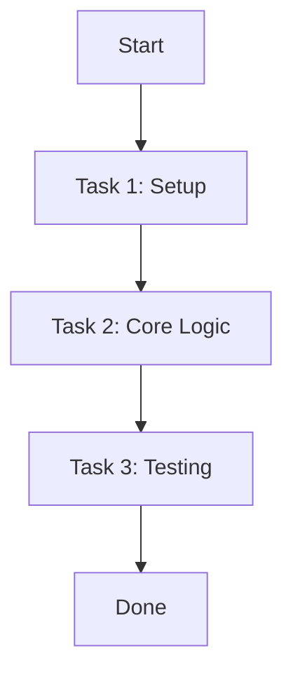
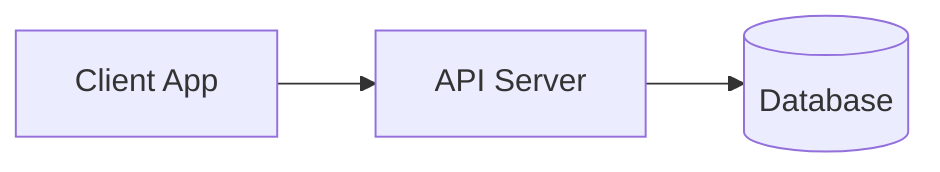

# Wiki Manager Artifact Templates

This document contains standardized Markdown templates for all artifacts stored in the `wiki/` directory.

---

## 1. Requirement Template (`requirement.md`)

```markdown
---
id: req-001
title: Title of Requirement 001
status: approved
derived_to:
  - story-001
  - story-002
  - plan-001
---

# Requirement: <Title>

## Scope
<scope of requirement, e.g. frontend/backend, API, DB schema>

## Description

**Goals**: <goal description>

**Target Users**: <list of target user personas>

<detailed description of the requirement>

## User Stories

### US-001: <User Story Title 1>
As a <user role>, I want to <action>, so that <benefit>.

### US-002: <User Story Title 2>
As a <user role>, I want to <action>, so that <benefit>.

## Functional Requirements

### FR-001: <Functional Requirement 1>
<description of functional requirement>

### FR-002: <Functional Requirement 2>
<description of functional requirement>

## Non-Functional Requirements

### NFR-001: <Non-Functional Requirement 1>
<performance, security, scalability, or reliability constraint>

## Testing Scenarios
1. <Scenario 1 description and expected outcome>
2. <Scenario 2 description and expected outcome>

## Success Criteria
- [ ] <Criterion 1>
- [ ] <Criterion 2>

## User Feedbacks
- **<Date>**: <Feedback summary or clarification from stakeholder>
```

---

## 2. Design Template (`design.md`)

```markdown
---
id: design-001
title: Technical Design for <Feature Name>
derived_from:
  - req-001
status: approved
---

# Design: <Feature Name>

## Design Decisions (Approved)

### Architecture
<High-level architectural choices and rationale — why these decisions were made>

### API Contracts
- **Endpoint**: `POST /api/v1/tasks`
- **Method**: `POST`
- **Request Body**:
  ```json
  { "name": "<string>", "priority": "<low|medium|high>" }
  ```
- **Response (Success)**:
  ```json
  { "id": "<int>", "status": "created", "created_at": "<timestamp>" }
  ```
- **Response (Error)**: `HTTP 400` with `{ "detail": "<error message>" }`

### Data Models
- **Task**: `<field>: <type> — <description>`
- **Task**: `id` — auto-incremented primary key
- **Task**: `name` — string, max 255 chars
- **Task**: `priority` — enum: low, medium, high
- **Task**: `status` — enum: pending, in_progress, completed
- **Task**: `created_at` — timestamp
- **Task**: `updated_at` — timestamp

### Dependencies
- **Internal**: `<module/path>`, `<service/path>`
- **External**: `<library>`, `<API>`

### UI Summary (Approved)
- Screen: `mockup/create-task.md` — Approved after user review cycle
- Screen: `mockup/task-list.md` — Approved after user review cycle

## Acceptance Criteria (from Requirement Success Criteria)
- [ ] <Criterion 1 — verifiable condition>
- [ ] <Criterion 2 — verifiable condition>

## Related Documents
- Requirement: `requirement.md`
- Plan: `plan.md`
```

---

## 3. Plan Template (`plan.md`)

```markdown
---
id: plan-001
title: Implementation Plan for Requirement 001
status: in_progress
derived_from:
  - req-001
---

# Plan: <Title>

## Implementation Plan

<detailed implementation breakdown and architecture approach>

## Implementation Process



## Tasks

### Task 1: <Task Title>

- **id**: I-001
- **type**: implementation
- **description**: <description of task 1>
- **status**: pending # pending | in_progress | completed
- **steps**:
  1. <Step 1>
  2. <Step 2>
  3. <Step 3>

### Task 2: <Task Title>

- **id**: T-002
- **type**: testing
- **description**: <description of task 2>
- **status**: pending
- **steps**:
  1. <Step 1>
  2. <Step 2>

## UI Mockup Link (if applicable)
- Relative path: `mockup/screen-name.md`
```

---

## 4. Mockup Template (`mockup/*.md`)

```markdown
---
id: mockup-001
title: Title of Mockup 001
derived_from:
  - req-001
---

# Mockup for <Screen/Feature Title>

## Screen Name: <Screen Name>

```text
┌──────────────────────────────────────────────────────┐
│ Header Title                                   [ X ] │
├──────────────────────────────────────────────────────┤
│                                                      │
│ ┌──────────────────────────┐                         │
│ │ Main Area                │                         │
│ └──────────────────────────┘                         │
│                                                      │
│                                [ Cancel ] [ Action ] │
└──────────────────────────────────────────────────────┘
```

## Components
- **Header**: Title, Close button
- **Content Area**: Main element details
- **Footer**: Action buttons

## Interactions
- User clicks "Action" -> triggers task processing.
- Input validation shows warning on empty state.

## Related Requirements
- `req-001`: <Link or description>
```

---

## 5. Evidence Template (`evidence.md`)

```markdown
---
id: ev-001
title: Testing Evidence for Plan 001
derived_from:
  - plan-001
status: passed
tested_at: 2026-08-18T23:00:00Z
environment: local
---

# Testing Evidence: <Title>

## Executed Tasks Trace

| Task ID | Type | Target Component | Result | Notes |
|---------|------|------------------|--------|-------|
| I-001   | Implementation | Core Engine | Completed | Build succeeded |
| T-002   | Testing | Unit Tests | Passed | 12/12 tests passed |

## Automated Test Execution Logs

```bash
$ pytest tests/test_feature.py
============================== 12 passed in 1.45s ==============================
```

## Manual Verification & Proof

- **Step 1**: Triggered endpoint `/api/v1/task` with payload `{ "name": "test" }`.
- **Response**: HTTP 200 OK - `{ "id": 1, "status": "created" }`.

## Quality & Security Audit Notes
- **Quality Reviewer**: Code architecture approved. No over-engineering detected.
- **Security Reviewer**: Sanitization verified. Zero SQLi / XSS vulnerabilities.
```

---

## 6. Log Template (`log.md`)

```markdown
# SDLC Activity Log

Chronological append-only record of all SDLC events. Never edit past entries.

## 2026-08-20

- **09:15** — [Requirement Analyzer] Created `req-001` — Task Management Core
- **09:45** — [User Designer] Created `design-001` — Task Management Core technical design
- **10:00** — [User Designer] Created `mockup-001` — Create Task Dialog
- **10:30** — [User Designer] Created `plan-001` — Task Management implementation plan
- **14:00** — [Constructor] Completed `evidence-001` — All tasks implemented and tested
- **15:00** — [Quality Reviewer] Approved quality-review — Iteration 1, status: APPROVED
- **15:30** — [Security Reviewer] Passed security-review — Iteration 1, status: PASS
```

---

## 7. System Architecture Template (`SYSTEM.md`)

```markdown
# System Architecture & Topology

## Overview
<High level system summary>

## Tech Stack
- **Language**: Python / TypeScript / etc.
- **Framework**: FastAPI / React / Node.js
- **Database**: PostgreSQL / SQLite

## Component Topology

```

---

## 7. High-Level Design Template (`DESIGN.md`)

```markdown
# High-Level Design Guidelines

## Core Principles
1. Maintain clean architecture and strict modular boundaries.
2. Store all SDLC artifacts within `wiki/` indexed by `registry.yaml`.
3. Provide traceability across requirements, plans, mockups, code, and evidence.
```
