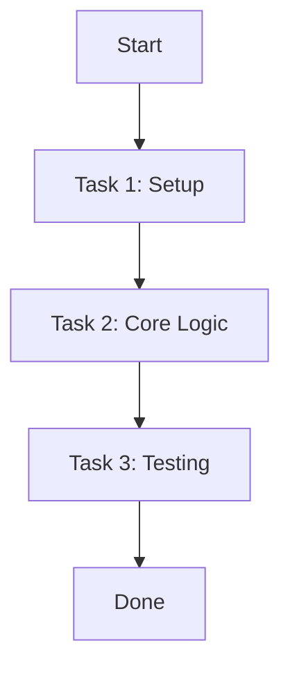
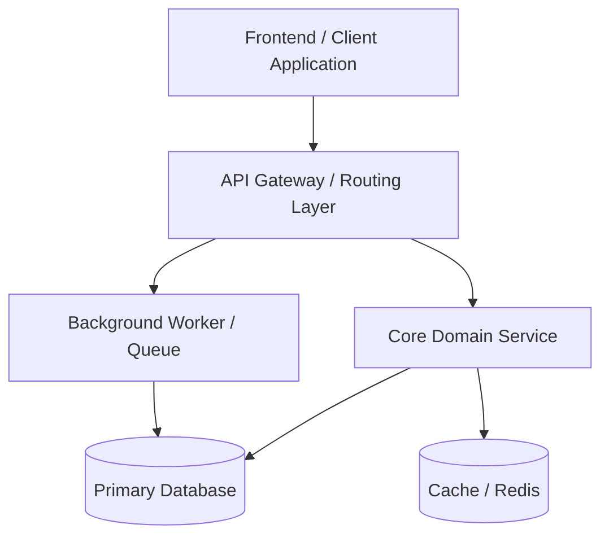

# Wiki Manager Artifact Templates

This document contains standardized Markdown templates for all artifacts stored in the `wiki/` directory.

---

## 1. Requirement Template (`requirement.md`)

```markdown
---
id: req-001
title: Title of Requirement 001
status: approved
derived_to:
  - story-001
  - story-002
  - plan-001
---

# Requirement: <Title>

## Scope
<scope of requirement, e.g. frontend/backend, API, DB schema>

## Description

**Goals**: <goal description>

**Target Users**: <list of target user personas>

<detailed description of the requirement>

## User Stories

### US-001: <User Story Title 1>
As a <user role>, I want to <action>, so that <benefit>.

### US-002: <User Story Title 2>
As a <user role>, I want to <action>, so that <benefit>.

## Functional Requirements

### FR-001: <Functional Requirement 1>
<description of functional requirement>

### FR-002: <Functional Requirement 2>
<description of functional requirement>

## Non-Functional Requirements

### NFR-001: <Non-Functional Requirement 1>
<performance, security, scalability, or reliability constraint>

## Testing Scenarios
1. <Scenario 1 description and expected outcome>
2. <Scenario 2 description and expected outcome>

## Success Criteria
- [ ] <Criterion 1>
- [ ] <Criterion 2>

## User Feedbacks
- **<Date>**: <Feedback summary or clarification from stakeholder>
```

---

## 2. Design Template (`design.md`)

```markdown
---
id: design-001
title: Technical Design for <Feature Name>
derived_from:
  - req-001
status: approved
---

# Design: <Feature Name>

## Design Decisions (Approved)

### Architecture
<High-level architectural choices and rationale — why these decisions were made>

### API Contracts
- **Endpoint**: `POST /api/v1/tasks`
- **Method**: `POST`
- **Request Body**:
  ```json
  { "name": "<string>", "priority": "<low|medium|high>" }
  ```
- **Response (Success)**:
  ```json
  { "id": "<int>", "status": "created", "created_at": "<timestamp>" }
  ```
- **Response (Error)**: `HTTP 400` with `{ "detail": "<error message>" }`

### Data Models
- **Task**: `<field>: <type> — <description>`
- **Task**: `id` — auto-incremented primary key
- **Task**: `name` — string, max 255 chars
- **Task**: `priority` — enum: low, medium, high
- **Task**: `status` — enum: pending, in_progress, completed
- **Task**: `created_at` — timestamp
- **Task**: `updated_at` — timestamp

### Dependencies
- **Internal**: `<module/path>`, `<service/path>`
- **External**: `<library>`, `<API>`

### UI Summary (Approved)
- Screen: `mockup/create-task.md` — Approved after user review cycle
- Screen: `mockup/task-list.md` — Approved after user review cycle

## Acceptance Criteria (from Requirement Success Criteria)
- [ ] <Criterion 1 — verifiable condition>
- [ ] <Criterion 2 — verifiable condition>

## Related Documents
- Requirement: `requirement.md`
- Plan: `plan.md`
```

---

## 3. Plan Template (`plan.md`)

```markdown
---
id: plan-001
title: Implementation Plan for Requirement 001
status: in_progress
derived_from:
  - req-001
---

# Plan: <Title>

## Implementation Plan

<detailed implementation breakdown and architecture approach>

## Implementation Process



## Tasks

### Task 1: <Task Title>

- **id**: I-001
- **type**: implementation
- **description**: <description of task 1>
- **status**: pending # pending | in_progress | completed
- **steps**:
  1. <Step 1>
  2. <Step 2>
  3. <Step 3>

### Task 2: <Task Title>

- **id**: T-002
- **type**: testing
- **description**: <description of task 2>
- **status**: pending
- **steps**:
  1. <Step 1>
  2. <Step 2>

## UI Mockup Link (if applicable)
- Relative path: `mockup/screen-name.md`
```

---

## 4. Mockup Template (`mockup/*.md`)

```markdown
---
id: mockup-001
title: Title of Mockup 001
derived_from:
  - req-001
---

# Mockup for <Screen/Feature Title>

## Screen Name: <Screen Name>

```text
┌──────────────────────────────────────────────────────┐
│ Header Title                                   [ X ] │
├──────────────────────────────────────────────────────┤
│                                                      │
│ ┌──────────────────────────┐                         │
│ │ Main Area                │                         │
│ └──────────────────────────┘                         │
│                                                      │
│                                [ Cancel ] [ Action ] │
└──────────────────────────────────────────────────────┘
```

## Components
- **Header**: Title, Close button
- **Content Area**: Main element details
- **Footer**: Action buttons

## Interactions
- User clicks "Action" -> triggers task processing.
- Input validation shows warning on empty state.

## Related Requirements
- `req-001`: <Link or description>
```

---

## 5. Evidence Template (`evidence.md`)

```markdown
---
id: ev-001
title: Testing Evidence for Plan 001
derived_from:
  - plan-001
status: passed
tested_at: 2026-08-18T23:00:00Z
environment: local
---

# Testing Evidence: <Title>

## Executed Tasks Trace

| Task ID | Type | Target Component | Result | Notes |
|---------|------|------------------|--------|-------|
| I-001   | Implementation | Core Engine | Completed | Build succeeded |
| T-002   | Testing | Unit Tests | Passed | 12/12 tests passed |

## Automated Test Execution Logs

```bash
$ pytest tests/test_feature.py
============================== 12 passed in 1.45s ==============================
```

## Manual Verification & Proof

- **Step 1**: Triggered endpoint `/api/v1/task` with payload `{ "name": "test" }`.
- **Response**: HTTP 200 OK - `{ "id": 1, "status": "created" }`.

## Quality & Security Audit Notes
- **Quality Reviewer**: Code architecture approved. No over-engineering detected.
- **Security Reviewer**: Sanitization verified. Zero SQLi / XSS vulnerabilities.
```

---

## 6. Log Template (`log.md`)

```markdown
# SDLC Activity Log

Chronological append-only record of all SDLC events. Never edit past entries.

## 2026-08-20

- **09:15** — [Requirement Analyzer] Created `req-001` — Task Management Core
- **09:45** — [User Designer] Created `design-001` — Task Management Core technical design
- **10:00** — [User Designer] Created `mockup-001` — Create Task Dialog
- **10:30** — [User Designer] Created `plan-001` — Task Management implementation plan
- **14:00** — [Constructor] Completed `evidence-001` — All tasks implemented and tested
- **15:00** — [Quality Reviewer] Approved quality-review — Iteration 1, status: APPROVED
- **15:30** — [Security Reviewer] Passed security-review — Iteration 1, status: PASS
```

---

## 7. System Architecture Template (`SYSTEM.md`)

```markdown
# System Architecture & Topology

## 1. Core Project Intent
<Clear summary of project mission, primary objectives, problem domain, and target users.>

## 2. High-Level Architecture
<High-level architectural style (e.g. Clean Architecture, Event-Driven, Microservices, Modular Monolith) and communication protocols.>



## 3. Tech Stack
- **Backend / Core Engine**: <Language, Runtime, Framework, e.g. Python 3.12, FastAPI, Pydantic>
- **Frontend / Client**: <Framework, State Management, Styling, e.g. React 19, TypeScript, Tailwind CSS, shadcn/ui>
- **Data & Storage**: <Databases, ORM, Migrations, Caching, e.g. PostgreSQL, SQLAlchemy, Alembic, Redis>
- **Build & Package Management**: <e.g. uv, pnpm, Docker>
- **Testing & Tooling**: <e.g. pytest, Vitest, Playwright, Ruff, ESLint>
- **External Integrations & APIs**: <Third-party services, LLM providers, OAuth, Payment gateways>

## 4. Directory Structure & Directory Purpose
```
project-root/
├── app/                  # Application runtime source code
│   ├── api/              # API endpoints, route controllers, request/response schemas
│   ├── core/             # Core configurations, security/auth, application lifecycle
│   ├── models/           # Database entity models and persistence schemas
│   ├── repositories/     # Data access layer and database query abstractions
│   ├── services/         # Business logic and domain service orchestration
│   └── utils/            # Shared helper functions and common utilities
├── frontend/             # Client application UI codebase
│   ├── src/components/   # Reusable UI component library (adhering to wiki/DESIGN.md)
│   ├── src/features/     # Feature-scoped views, hooks, and presentation state
│   └── src/styles/       # Global CSS, theme variables, and design tokens
├── tests/                # Automated test suites
│   ├── unit/             # Fast isolated unit tests
│   └── integration/      # End-to-end and database integration tests
├── wiki/                 # Central SDLC documentation and knowledge wiki
│   ├── registry.yaml     # Module registry & review configuration
│   ├── DESIGN.md         # UI/UX design standards & component conventions
│   └── SYSTEM.md         # System architecture, topology, and boundaries
└── scripts/              # Automation scripts, devops workflows, and seed data
```

### Directory Usage Breakdown
- `app/api/`: Handles incoming HTTP/RPC traffic, validates requests with schemas, and maps to services.
- `app/services/`: Encapsulates pure business logic without direct HTTP dependencies.
- `app/models/` & `app/repositories/`: Isolates database operations and schema definitions.
- `frontend/`: Standalone client frontend; all UI elements must implement `wiki/DESIGN.md` guidelines.
- `wiki/`: Single source of truth for SDLC artifacts and project knowledge.

## 5. Monorepo App Boundaries & Modular Isolation
- **Boundary Rules**:
  - `frontend/` cannot import directly from `app/` internal modules; communicates strictly via REST/GraphQL API.
  - Domain services in `app/services/` must remain decoupled from specific database drivers (utilize repositories).
  - Shared models or contracts must be exposed via designated interface packages or OpenAPI specifications.

## 6. Architectural Principles & Non-Functional Constraints
- **Performance**: P95 response times < 200ms for core endpoints.
- **Security**: Strict input validation, zero trust authentication, role-based access control.
- **Maintainability**: Clear separation of concerns, test coverage >= 80% for domain logic.
```

---

## 8. UI/UX Design Standards Template (`DESIGN.md`)

```markdown
# UI/UX Design Standards & Style Guide

> [!IMPORTANT]
> **Single Source of Truth for UI Components**
> When any Agent creates, modifies, or refactors UI components, layouts, or wireframes, it MUST adhere strictly to the design system, styling rules, and tokens specified in this document.

## 1. Visual Theme & Philosophy
- **Aesthetic Direction**: <e.g., Clean modern minimal, dense data-rich dashboard, playful accessible SaaS>
- **Design Metaphor**: <e.g., Flat design with subtle elevation and micro-borders>
- **Mode Support**: Light mode and Dark mode with consistent contrast ratios (WCAG AA minimum).

## 2. Design Tokens

### Color Palette
- **Primary / Brand**: `#2563EB` (Blue 600) — Primary CTAs, active highlights
- **Primary Hover**: `#1D4ED8` (Blue 700)
- **Secondary / Accent**: `#7C3AED` (Violet 600) — Special badges, highlights
- **Neutral Background (Light)**: `#F8FAFC` (Slate 50) | **Dark**: `#0F172A` (Slate 900)
- **Surface / Card (Light)**: `#FFFFFF` | **Dark**: `#1E293B` (Slate 800)
- **Text Primary (Light)**: `#0F172A` | **Dark**: `#F8FAFC`
- **Text Secondary (Light)**: `#64748B` | **Dark**: `#94A3B8`
- **Border / Divider (Light)**: `#E2E8F0` | **Dark**: `#334155`
- **Feedback Colors**:
  - Success: `#16A34A` (Green 600)
  - Warning: `#D97706` (Amber 600)
  - Error / Danger: `#DC2626` (Red 600)
  - Info: `#0284C7` (Sky 600)

### Typography
- **Font Family**:
  - Primary UI: `Inter, -apple-system, BlinkMacSystemFont, "Segoe UI", Roboto, sans-serif`
  - Code / Monospace: `"JetBrains Mono", "Fira Code", monospace`
- **Scale & Hierarchy**:
  - Heading 1: `2rem (32px)` / Bold (700) / Line-height `1.2`
  - Heading 2: `1.5rem (24px)` / Semi-bold (600) / Line-height `1.3`
  - Heading 3: `1.25rem (20px)` / Semi-bold (600) / Line-height `1.4`
  - Body Regular: `1rem (16px)` / Normal (400) / Line-height `1.5`
  - Body Small / Caption: `0.875rem (14px)` / Normal (400) / Line-height `1.4`
  - Microcopy / Tag: `0.75rem (12px)` / Medium (500)

### Spacing & Elevation
- **Grid Baseline**: `4px` grid (`4px`, `8px`, `12px`, `16px`, `24px`, `32px`, `48px`, `64px`)
- **Border Radius**: Small (`4px`), Medium (`8px`), Large (`12px`), Pill (`9999px`)
- **Shadows**:
  - Subtle (Card): `0 1px 3px 0 rgba(0, 0, 0, 0.1), 0 1px 2px -1px rgba(0, 0, 0, 0.1)`
  - Elevated (Dropdown/Popover): `0 4px 6px -1px rgba(0, 0, 0, 0.1), 0 2px 4px -2px rgba(0, 0, 0, 0.1)`
  - Modal / Overlay: `0 20px 25px -5px rgba(0, 0, 0, 0.1), 0 8px 10px -6px rgba(0, 0, 0, 0.1)`

## 3. UI Component Standards

### Buttons
- **Primary**: Solid primary color background, white text, 8px radius, medium font weight.
- **Secondary**: Outlined with border color, surface background, primary text.
- **Danger / Destructive**: Solid error red background or red text on ghost button for low-risk actions.
- **States Required**: Default, Hover, Active, Focus Ring (2px offset), Disabled (`opacity: 50%`, `cursor: not-allowed`), Loading (spinner + text).

### Form Controls & Inputs
- Standard height: `40px` (Desktop), `44px` (Touch).
- Clear labels above inputs, mandatory indicators (`*`), helper text below.
- Validation states: Inline red error message below input with red border on field; success indicators where helpful.

### Cards & Surfaces
- Padding: `16px` (Compact) or `24px` (Standard).
- Subtle 1px border with light background; hover state with slight elevation shift if clickable.

### Modals & Dialogs
- Backdrop overlay with blur (`backdrop-blur-sm bg-black/50`).
- Clear header with title + close button (`X`), scrollable body, fixed footer with `[Cancel]` and `[Primary Action]`.

## 4. Responsive & Layout Rules
- **Breakpoints**: Mobile (`< 640px`), Tablet (`640px - 1024px`), Desktop (`> 1024px`).
- **Layout Behavior**:
  - Desktop: Multi-column grid, persistent sidebar/navigation.
  - Mobile: Single-column stack, collapsible drawer navigation, full-width touch targets.

## 5. Agent Code Compliance Checklist
When generating or reviewing UI code, verify:
- [ ] Uses defined color tokens and theme variables (no raw arbitrary hex colors).
- [ ] Matches typography scale and line heights.
- [ ] Includes all interaction states (hover, focus, disabled, loading).
- [ ] Accessible color contrast ratio (WCAG 2.1 AA compliant).
- [ ] Responsive across defined breakpoints without horizontal overflow.
```
